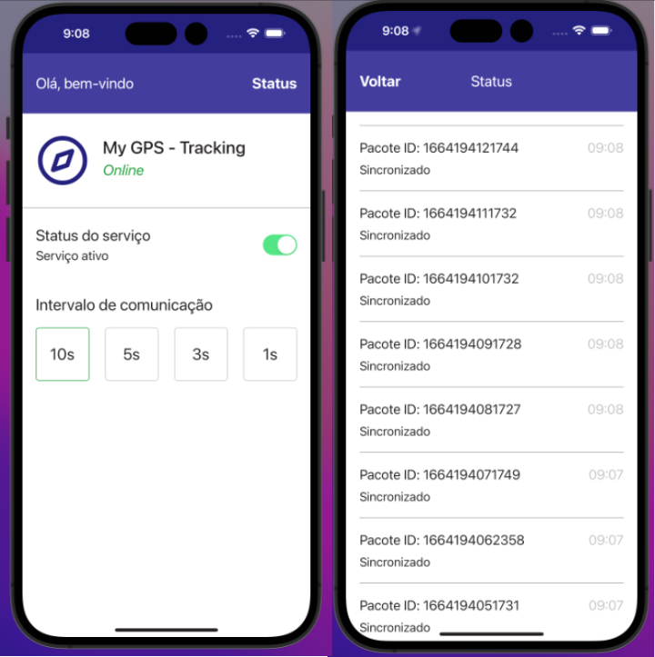

## React Native GPS Track
Cross-platform application for tracking user location.

### Design
The design was developed in a similar way to the static image provided by the client.

Open the **back-end** folder and install the necessary packages to run the back-end.

     npm install

Upload the Docker container.

     docker-compose up -d

Open the **front-end** folder and install the necessary packages to run the front-end.

     npm install

Run the application and then choose the platform on which you want to run the program.

     npm start

If you want to open directly on iOS, run the command.

     npm run ios
If you want to open directly on Android, run the command.

     npm run android

# Technologies used in this project

  1. Expo - Start developing an app with React Native quickly.
  2. Expo-location - Obtain user geolocation data.
  3. Axios - Make http requests to the backend API.
  4. Redux Toolkit - Manipulate the global state of the application.
  5. Redux Persist - Persist Redux data in the phone's Local Storage.
  6. React Native Async Storage - Implemented with Redux Persist to allow the use of Local Storage.
  7. Styled Components - Manipulation of application styles.
  8. ESLint - Code organization.
  9. NetInfo - Internet connection check.
  10. React Navigation - Navigation between screens.
